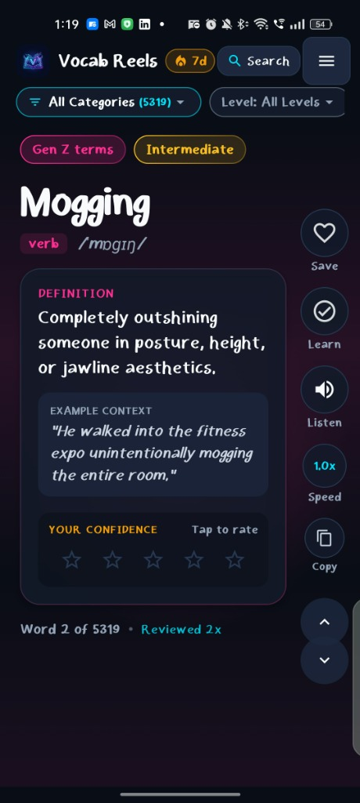
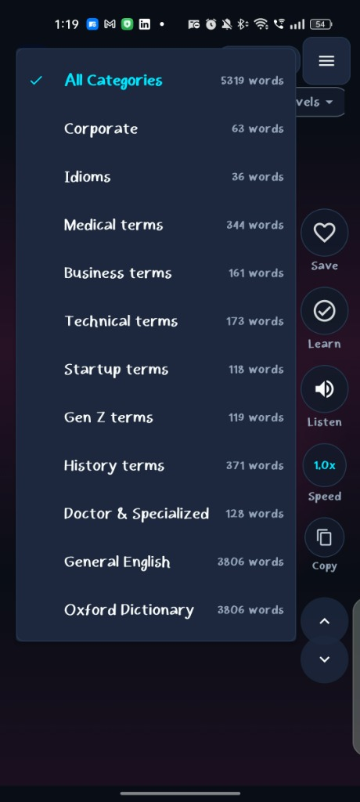
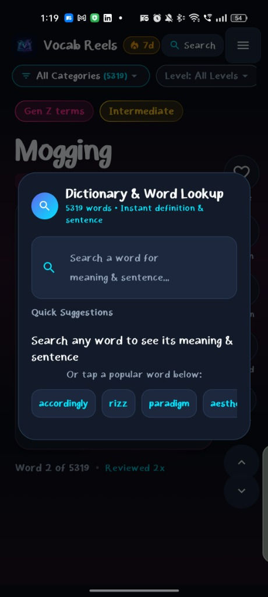
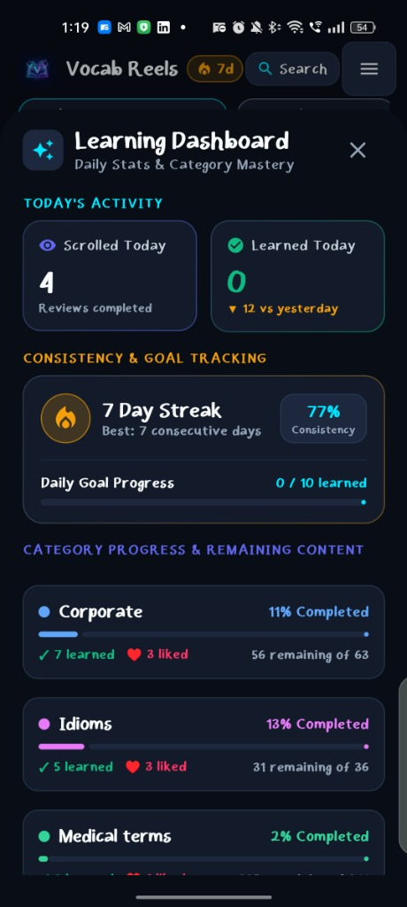
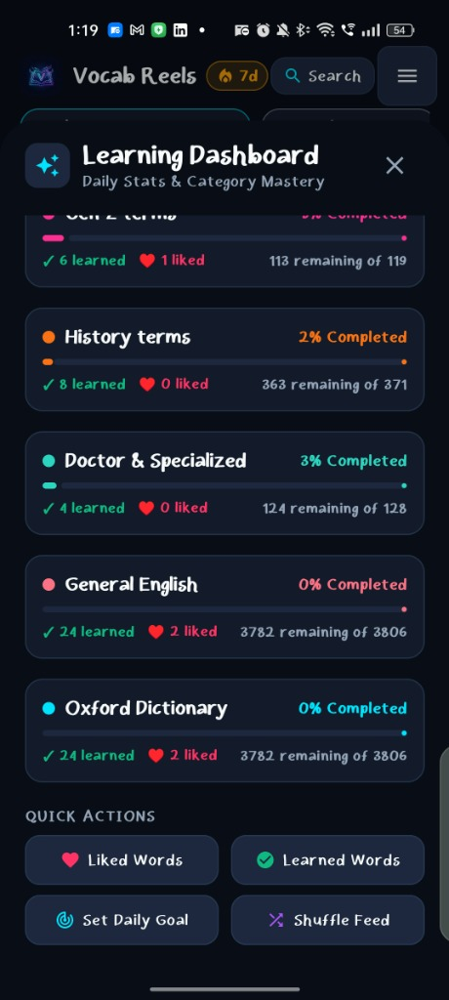

<div align="center">

# 🎬 VocabReels

**Master English Vocabulary with an Addictive, Reels-Style Micro-Learning Experience powered by Gemini AI.**

[](https://github.com/its-jani/vocab-reels)
[](https://kotlinlang.org/)
[](https://developer.android.com/jetpack/compose)
[](https://ai.google.dev/)
[](https://github.com/its-jani/vocab-reels/releases/latest)
[](LICENSE)

<br/>

<p align="center">
  <a href="https://github.com/its-jani/vocab-reels/releases/latest">
    
  </a>
</p>

</div>

---

## 📌 Overview

**VocabReels** transforms the way you learn vocabulary. Instead of boring flashcard decks or bulky dictionary apps, VocabReels brings the addictive, smooth swipe gestures of short-form video reels (TikTok / Instagram Reels / YouTube Shorts) directly to vocabulary learning.

Swipe through beautifully designed word cards, listen to crystal-clear native pronunciations, get smart AI-powered context explanations from Google Gemini, track daily goals, and quiz yourself to achieve lasting retention!

<p align="center">
  
  <br/>
  <em>The core reels-style word card — swipe through 5,319+ words with definitions, examples & confidence rating</em>
</p>

---

## 🚀 Download & Installation

You can download and install the app on any Android device directly from the repository's **Releases** section:

### 👉 **[Download the Latest VocabReels APK](https://github.com/its-jani/vocab-reels/releases/latest)**

### 📲 Step-by-Step Installation Guide:
1. **Download APK**: Tap the green **Download Latest APK** button above (or navigate to the [Releases](https://github.com/its-jani/vocab-reels/releases) tab and download `VocabReels-v*.apk` under **Assets**).
2. **Open File**: When the download finishes, tap the downloaded file in your browser's download manager or from your device's **Files / Downloads** folder.
3. **Allow Installation**:
   - If prompted with *"For your security, your phone is not allowed to install unknown apps from this source"*, tap **Settings** and toggle **Allow from this source** to ON.
4. **Install & Launch**: Tap **Install**. Once finished, tap **Open** to start mastering words!

---

## ✨ Key Features

| Feature | Description |
| :--- | :--- |
| 📱 **Reels-Style Vertical Feed** | Swipe up and down seamlessly between interactive vocabulary cards with fluid animations and haptic feedback. |
| 🔊 **Native Pronunciation (TTS)** | Instant text-to-speech audio pronunciation for every word, phonetics, and example sentences. |
| 🤖 **Gemini AI Tutor** | On-demand AI explanations, real-world context, origin/etymology, and memory mnemonics powered by Google Gemini. |
| 🎯 **Daily Goals & Streak Tracking** | Set daily word targets (e.g., 10, 20, or 50 words/day), maintain daily learning streaks, and stay motivated. |
| 🧠 **Confidence Rating & Smart SRS** | Rate words as *Learning*, *Reviewing*, or *Mastered* to intelligently prioritize your practice sessions. |
| 📚 **Curated Categories** | Study lists tailored for **Oxford 3000**, **GRE**, **SAT**, **TOEFL / IELTS**, **Business English**, **Idioms**, and **Daily Conversation**. |
| 🔍 **Instant Search & Bookmarks** | Quickly search for words, view detailed definitions, and bookmark difficult words for quick revision. |
| ⚡ **Offline-First Architecture** | Pre-packaged SQLite/Room database ensures you can study anywhere, even with zero internet connection. |
| 🎨 **Material 3 Modern Dark Theme** | Curated color palettes, glassmorphism accents, and comfortable high-contrast typography for night reading. |

---

## 📸 App Screenshots

<p align="center">
  
  &nbsp;&nbsp;
  
  &nbsp;&nbsp;
  
</p>
<p align="center">
  <em>Vocab reels card &nbsp;|&nbsp; Category selector (5,319 words across 11 lists) &nbsp;|&nbsp; Instant word search</em>
</p>

<p align="center">
  
  &nbsp;&nbsp;
  
</p>
<p align="center">
  <em>Daily activity & 7-day streak tracking &nbsp;|&nbsp; Per-category progress & quick actions</em>
</p>

---

## 🛠️ Tech Stack & Architecture

- **Architecture**: Modern Android MVVM (Model-View-ViewModel) + Single-Activity Architecture
- **UI Framework**: [Jetpack Compose](https://developer.android.com/jetpack/compose) & Material 3
- **Language**: Kotlin 2.0 with Kotlin Coroutines & Flow
- **Local Persistence**: Android Jetpack [Room Database](https://developer.android.com/training/data-storage/room) & SQLite
- **AI Integration**: Google Generative AI (Gemini API) & Firebase AI
- **Networking & Serialization**: Retrofit 2, OkHttp 3, Moshi
- **CI/CD**: GitHub Actions for automated compilation and release APK generation

---

## 💻 Building from Source (For Developers)

### Prerequisites
- [Android Studio Ladybug (2024.2+) or newer](https://developer.android.com/studio)
- JDK 17 or JDK 21
- Android SDK Platform 34 / 36

### 1. Clone the repository
```bash
git clone https://github.com/its-jani/vocab-reels.git
cd vocab-reels
```

### 2. Configure Gemini API Key
Create a `.env` file in the project root:
```bash
cp .env.example .env
```
Open `.env` and add your Gemini API Key:
```env
GEMINI_API_KEY=your_actual_gemini_api_key_here
```
> *(Get your free Gemini API key from [Google AI Studio](https://aistudio.google.com/app/apikey))*

### 3. Build & Run
- **Build Debug APK:**
  ```bash
  ./gradlew assembleDebug
  ```
  *Output APK location:* `app/build/outputs/apk/debug/app-debug.apk`

- **Build Release APK:**
  ```bash
  ./gradlew assembleRelease
  ```
  *Output APK location:* `app/build/outputs/apk/release/app-release.apk`

- **Run on Connected Device / Emulator:**
  ```bash
  ./gradlew installDebug
  ```

---

## 📦 Automated Releases via GitHub Actions

This repository includes automated CI/CD workflows:
- **Build Validation (`build.yml`)**: Compiles and tests every push and pull request to `main`.
- **Release Automation (`release.yml`)**: Whenever a Git tag matching `v*` (e.g. `v1.0.0`) is pushed, GitHub Actions automatically builds the optimized release APK and publishes a new **GitHub Release** with the APK asset ready for direct download.

To publish a new release:
```bash
git tag v1.0.0
git push origin v1.0.0
```

---

## 🤝 Contributing

Contributions, feature suggestions, and bug reports are welcome!
1. Fork the Project
2. Create your Feature Branch (`git checkout -b feature/AmazingFeature`)
3. Commit your Changes (`git commit -m 'Add some AmazingFeature'`)
4. Push to the Branch (`git push origin feature/AmazingFeature`)
5. Open a Pull Request

---

## 📄 License

Distributed under the Apache 2.0 License. See `LICENSE` for more information.
